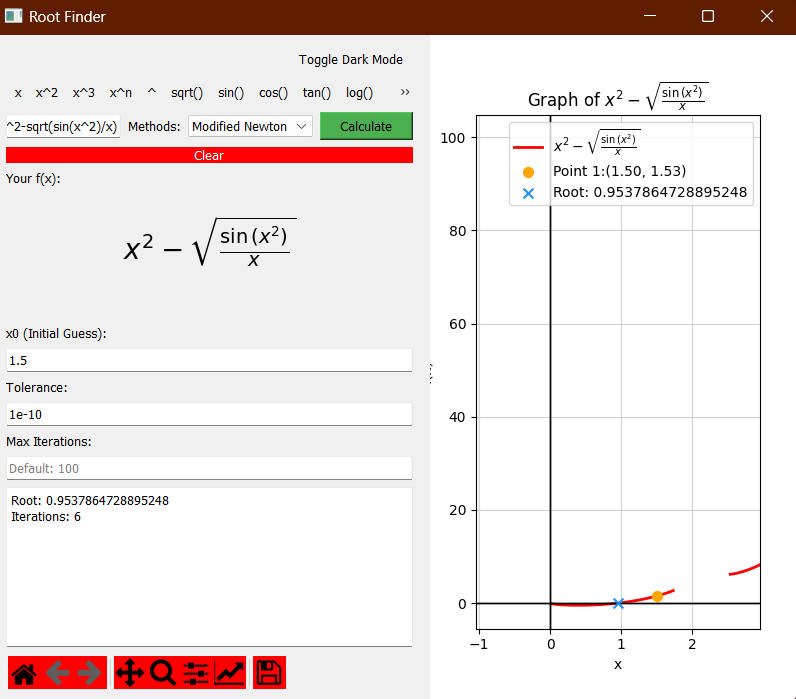
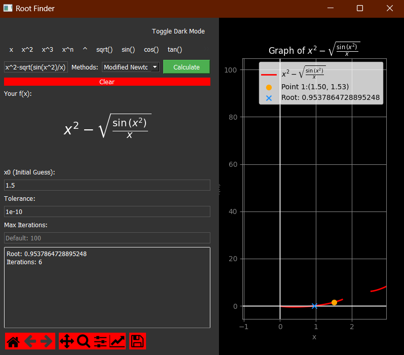

# Root-Finder

`Root-Finder` is a Python application built using PyQt5 for finding the roots of mathematical functions using various methods, such as Bisection, False Position, Newton's, Modified Newton's, and Secant methods. It offers a user-friendly GUI, allowing users to visualize functions and results easily.

<div style="display: flex; justify-content: center;">
    
    
</div>

## Features

- **Function Visualization**: Plot any function and view its curve on a graph.
- **LaTeX Support**: Input your mathematical expression and view it in beautifully formatted LaTeX.
- **Multiple Methods**: Choose from several methods to compute the roots.
- **Dark Mode**: Toggle between light and dark themes to match your mood and preferences.
- **Intuitive UI**: Easily insert mathematical symbols with a single click.

## Installation and Setup

1. Clone the repository:
```bash
git clone https://github.com/D-Gaspa/root-finder.git
```

2. Navigate to the project directory and install required packages:
```bash
cd Root-Finder
pip install -r requirements.txt
```

3. Run the application:
```bash
python main.py
```

## Usage

1. Enter your function in the provided input box.
2. Choose a root-finding method from the dropdown menu.
3. Provide the required parameters for the selected method.
4. Click on `Calculate` to compute the root.
5. View the results in the results display and the graph.

## Contribution

Pull requests are welcome! For major changes, please open an issue first to discuss what you would like to change.
